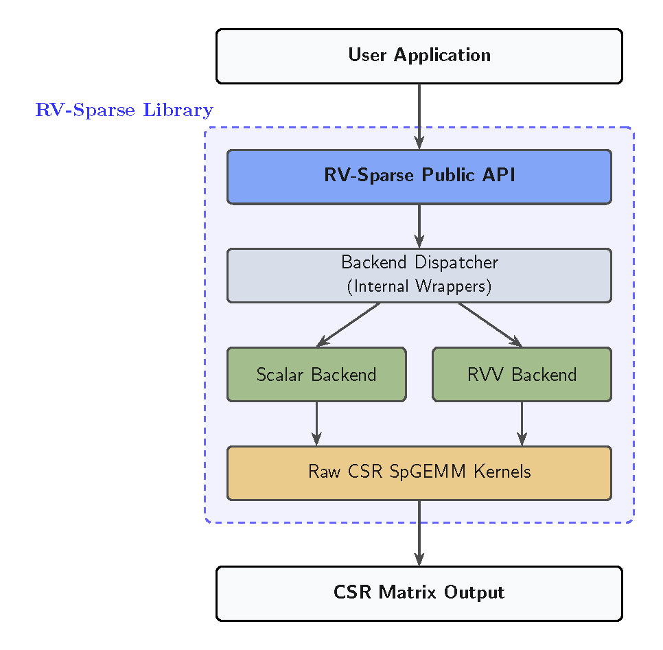
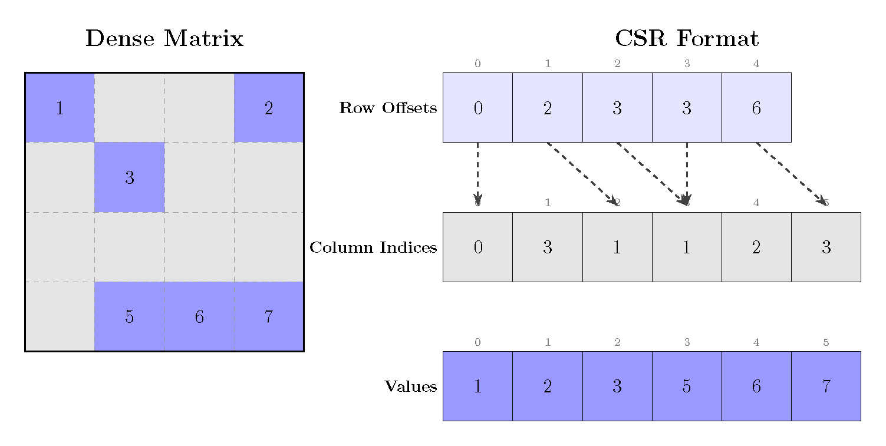

# RV-Sparse


**RV-Sparse** is an open-source sparse linear algebra library for RISC-V, with experimental support for RISC-V Vector (RVV) acceleration.

The project focuses on CSR-based Sparse General Matrix-Matrix Multiplication (SpGEMM) and provides scalar reference kernels, RVV experimental kernels, backend dispatch infrastructure, examples, and documentation for performance-oriented sparse computing.

```text
C = A × B
```

where `A`, `B`, and `C` are sparse matrices.

---

## Overview

RV-Sparse is designed as a modular C library for sparse matrix computation on RISC-V platforms.

The library currently provides:

- CSR sparse matrix representation.
- CSR SpGEMM kernels.
- Scalar baseline implementations.
- Experimental RISC-V Vector kernels.
- INT8, FP32, and FP64 kernel paths where available.
- Two-pass exact output preallocation.
- Gustavson/SPA-style row-wise accumulation.
- Backend selection infrastructure.
- Examples and documentation for development and evaluation.

The project is currently under active development and is being prepared as part of a mid-evaluation RISC-V sparse linear algebra submission.

---

## Main Features

- **CSR-first sparse matrix support**
- **CSR SpGEMM: `C = A × B`**
- **Scalar reference kernels**
- **Experimental RVV kernels**
- **Backend-oriented design**
- **Support for multiple data types**
- **Exact output preallocation**
- **Performance analysis friendly structure**
- **Clean separation between public API and raw kernels**

---

## High-Level Architecture

RV-Sparse is organized in layers:



This design keeps the user-facing API stable while allowing different kernel implementations underneath.

Raw kernels are intentionally separated from the public API so they can be benchmarked, profiled, replaced, or optimized independently.

---

## Supported Matrix Format

### CSR: Compressed Sparse Row



RV-Sparse currently focuses on CSR matrices.

A sparse matrix in CSR format is represented by:

```text
rows      number of matrix rows
cols      number of matrix columns
nnz       number of nonzero values
row_ptr   row offset array of length rows + 1
col_idx   column index array of length nnz
values    nonzero values array of length nnz
```

For a matrix `A`, row `i` is stored in:

```text
row_start = row_ptr[i]
row_end   = row_ptr[i + 1]
```

The nonzeros in row `i` are:

```text
for p = row_start to row_end - 1:
    column = col_idx[p]
    value  = values[p]
```

---

## CSR Example

Dense matrix:

```text
A = [ 10  0  0  2
       3  9  0  0
       0  7  8  0
       0  0  0  6 ]
```

CSR representation:

```text
rows    = 4
cols    = 4
nnz     = 7

values  = [10, 2, 3, 9, 7, 8, 6]
col_idx = [ 0, 3, 0, 1, 1, 2, 3]
row_ptr = [ 0, 2, 4, 6, 7]
```

---

## Current Scope

The current development focus is CSR SpGEMM:

```text
C = A × B
```

where `A`, `B`, and `C` are sparse matrices in CSR format.

Implemented or under active development:

- CSR matrix representation.
- CSR SpGEMM scalar backends.
- CSR SpGEMM RVV experimental backends.
- Two-pass preallocation strategy for exact output allocation.
- SPA/Gustavson-style row accumulation.
- INT8, FP32, and FP64 kernel paths where available.
- Example programs and matrix data utilities.
- Benchmark and profiling-oriented metadata collection.

---

## CSR SpGEMM Execution Model

RV-Sparse currently uses a row-wise Gustavson/SPA-style SpGEMM algorithm.

For each row `i` of `A`:

```text
for each nonzero A(i,k):
    scan row B(k,:)
    accumulate into temporary row accumulator
```

Conceptually:

```text
C(i,j) += A(i,k) * B(k,j)
```

The temporary workspace tracks which columns have been touched in the current output row.

Typical workspace:

```text
acc[col]      temporary accumulated value
mark[col]     whether column col was touched
touched[]     list of touched columns
```

This avoids clearing the full dense accumulator for every row.

---

## Algorithm 1: Scalar Row-Wise Gustavson/SPA CSR SpGEMM

```text
Input:
    CSR matrices A and B

Output:
    CSR matrix C = A × B

1:  allocate dense accumulator acc[num_cols_B]
2:  allocate mark[num_cols_B]
3:  allocate touched[num_cols_B]
4:  allocate C_row_ptr[num_rows_A + 1]

5:  for i = 0 to num_rows_A - 1 do
6:      touched_count = 0

7:      for each nonzero A(i,k) do
8:          a_val = A(i,k)

9:          for each nonzero B(k,col) do
10:             if col is not marked do
11:                 mark[col] = true
12:                 append col to touched
13:                 acc[col] = 0
14:             end if

15:             acc[col] += a_val * B(k,col)
16:         end for
17:     end for

18:     sort touched columns
19:     count nonzero entries in acc[touched]
20:     update C_row_ptr[i + 1]
21:     clear acc and mark entries in touched
22: end for

23: allocate C_col_idx and C_values using the computed nnz(C)
24: repeat the same row-wise accumulation
25: write sorted nonzero acc[touched] entries into C
26: return C
```

---

## Algorithm 2: RVV Indexed Row-Wise Gustavson/SPA CSR SpGEMM

The RVV path attempts to vectorize the accumulation over entries of rows of `B`.

Because sparse accumulation uses indirect column indices, the RVV implementation may require indexed loads and stores into the accumulator.

```text
Input:
    CSR matrices A and B

Output:
    CSR matrix C = A × B

1:  detect duplicate column indices in rows of B
2:  allocate dense accumulator acc[num_cols_B]
3:  allocate mark[num_cols_B]
4:  allocate touched[num_cols_B]
5:  allocate C_row_ptr[num_rows_A + 1]

6:  for i = 0 to num_rows_A - 1 do
7:      touched_count = 0

8:      for each nonzero A(i,k) do
9:          a_val = A(i,k)

10:         scan row B(k,:) to mark touched columns

11:         if row B(k,:) has duplicate columns do
12:             accumulate B(k,:) into acc using scalar code
13:         else
14:             vload B column indices
15:             vload B values
16:             vgather acc[B_col_idx]
17:             vacc = vacc + a_val * B_values
18:             vscatter acc[B_col_idx]
19:         end if
20:     end for

21:     sort touched columns
22:     count nonzero entries in acc[touched]
23:     update C_row_ptr[i + 1]
24:     clear acc and mark entries in touched
25: end for

26: allocate C_col_idx and C_values using the computed nnz(C)
27: repeat the same row-wise RVV/scalar-fallback accumulation
28: write sorted nonzero acc[touched] entries into C
29: return C
```

---

## Notes on RVV SpGEMM

The RVV kernels are experimental and are not assumed to be faster for every sparse workload.

Sparse SpGEMM may be limited by:

- Irregular memory access.
- Indexed gather/scatter overhead.
- Accumulator and marker traffic.
- Row imbalance.
- Small row sizes.
- Low reuse.
- Cache and memory latency.
- Duplicate column handling.

For this reason, RVV acceleration must be validated per workload and compared against scalar baselines.

Future optimization work includes scalar/RVV hybrid dispatch policies based on row-level workload characteristics.

---

## Build

A standard local build can be started with:

```bash
make clean
make
```

For a RISC-V cross-compilation environment:

```bash
make clean
make CC=riscv64-unknown-linux-gnu-gcc
```

For RVV-enabled builds, the compiler must support RISC-V Vector intrinsics and the target architecture must include vector support.

Example target flags may include:

```text
-march=rv64gcv
-mabi=lp64d
```

The exact compiler flags depend on the toolchain and target platform.

---

## Quick Start

### Include the library header

```c
#include "rv_sparse.h"
```

### Create CSR matrices

A CSR matrix is described using row pointers, column indices, and values.

```c
rvsp_csr_matrix_t A;
rvsp_csr_matrix_t B;
rvsp_csr_matrix_t C;
```

Example conceptual initialization:

```c
A.rows = M;
A.cols = K;
A.nnz = A_nnz;
A.row_ptr = A_row_ptr;
A.col_idx = A_col_idx;
A.values = A_values;

B.rows = K;
B.cols = N;
B.nnz = B_nnz;
B.row_ptr = B_row_ptr;
B.col_idx = B_col_idx;
B.values = B_values;
```

### Select SpGEMM options

```c
rvsp_spgemm_options_t options;

options.backend = RVSP_BACKEND_AUTO;
options.dtype = RVSP_DTYPE_F32;
```

### Run SpGEMM

```c
rvsp_status_t status = rvsp_spgemm_csr(&A, &B, &C, &options);

if (status != RVSP_SUCCESS) {
    /* handle error */
}
```

### Release output memory

```c
rvsp_csr_free(&C);
```

The exact public API may evolve as the project stabilizes. See `include/` and `docs/api_design.md` for the current definitions.

---

## Backend Selection

RV-Sparse is designed to support multiple backends.

Typical backend modes include:

```text
RVSP_BACKEND_AUTO
RVSP_BACKEND_SCALAR
RVSP_BACKEND_RVV
```

Recommended behavior:

```text
AUTO    library selects an available backend
SCALAR  force scalar baseline implementation
RVV     force RVV implementation when available
```

Scalar backends are used as correctness and performance baselines. RVV backends are experimental and should be validated on the target workload and hardware.

---

## Data Types

The project includes or is actively developing kernel paths for:

```text
INT8
FP32
FP64
```

Backend availability may differ by data type.

---

## Repository Layout

```text
include/      Public headers and API definitions
src/          Library implementation
examples/     Example programs and usage demos
tests/        Validation tests
docs/         Project documentation
scripts/      Utility scripts
matrices/     Matrix inputs used for experiments
matrix_data/  Additional matrix-related data
```

More details are available in:

```text
docs/directory_structure.md
```

---

## Documentation

Available documentation:

- `docs/README.md`  
  Documentation index.

- `docs/api_design.md`  
  API and backend architecture.

- `docs/directory_structure.md`  
  Repository structure and file organization.

---

## Examples

Example programs are located in:

```text
examples/
```

Typical usage:

```bash
make examples
```

or, depending on the available Makefile targets:

```bash
make
./examples/<example_binary>
```

See the `examples/` directory for currently available programs.

---

## Testing

Run the available tests with:

```bash
make test
```

If the Makefile does not yet expose a test target, tests can be built and run manually from the `tests/` directory.

---

## Development Status

RV-Sparse is currently experimental.

The scalar kernels are used as correctness and performance baselines. RVV kernels are being evaluated and optimized using profiling data, matrix workload characterization, and hardware counters.

The current goal is to make the library usable, testable, and extensible while progressively improving RVV performance.

---

## Contributing

Contributions should keep changes focused and easy to review.

Recommended workflow:

1. Create a feature branch.
2. Add or update the relevant kernel/API code.
3. Add correctness tests.
4. Add or update examples if user-facing behavior changes.
5. Benchmark against the scalar baseline.
6. Document backend limitations and performance assumptions.
7. Submit a pull request.

See:

```text
CONTRIBUTING.md
```

---

## License

See:

```text
LICENSE
```
