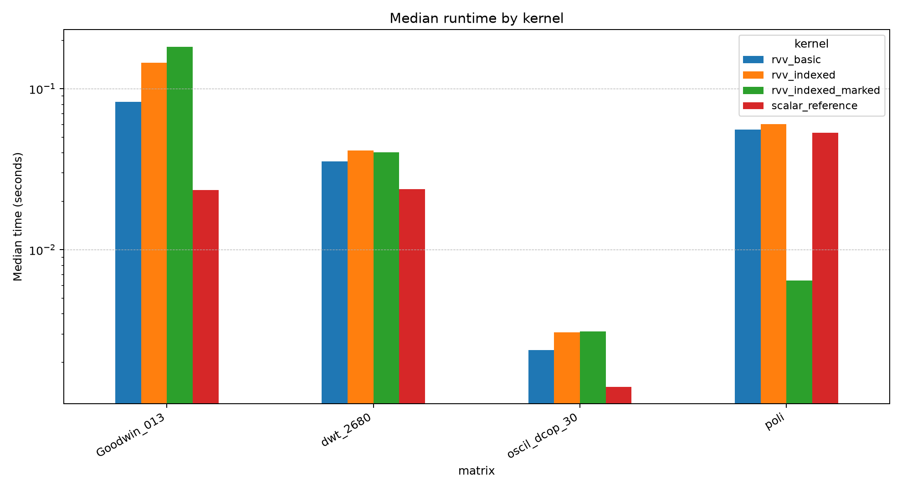
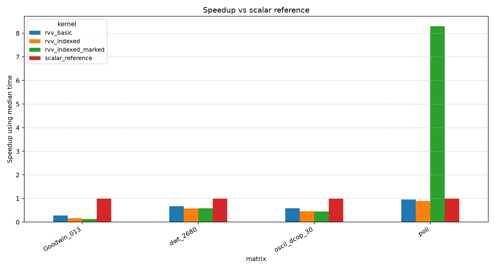
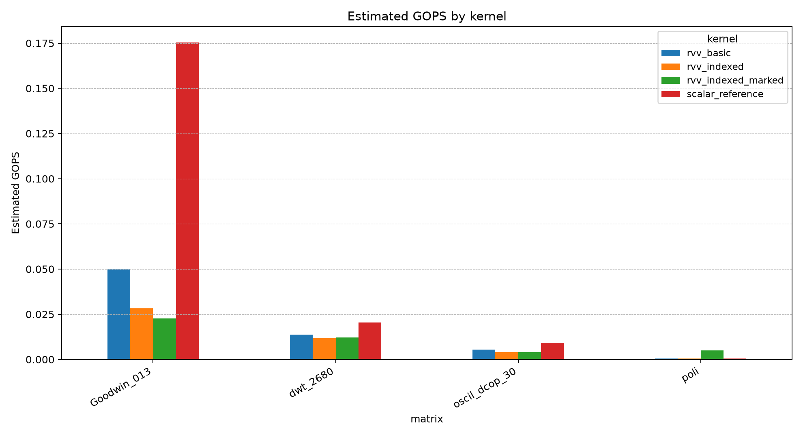
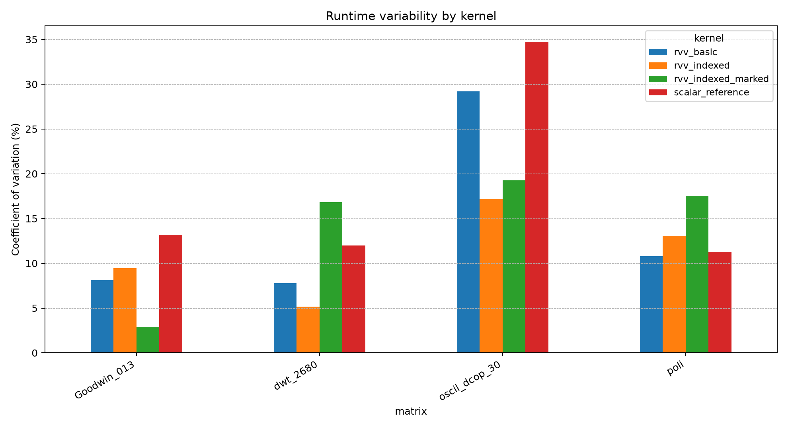
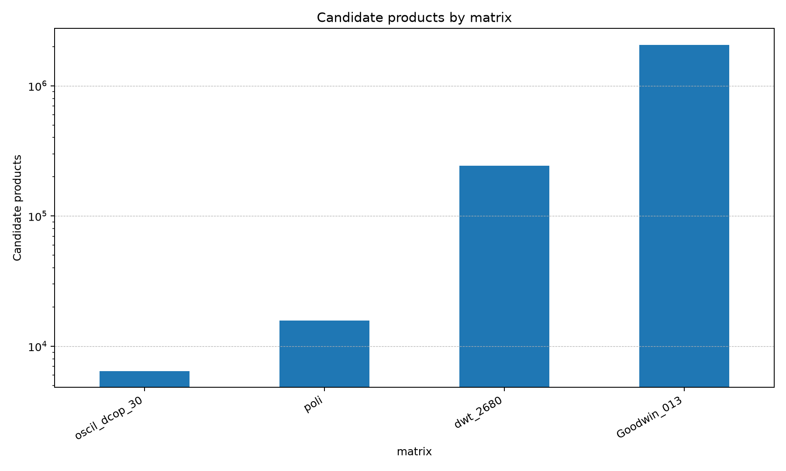
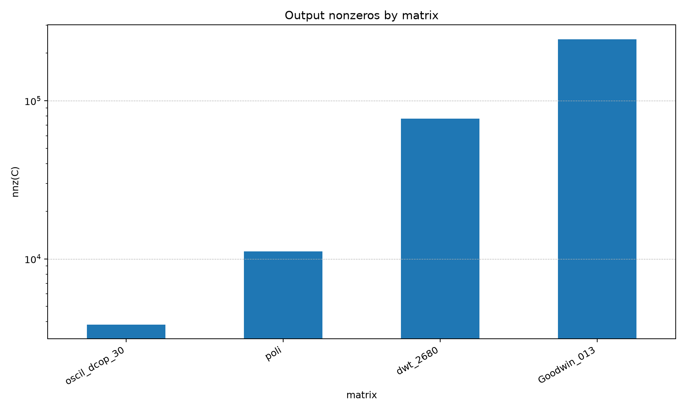

# Raw Kernel Experiments

This directory contains experimental raw kernels for `rv-sparse`.

The purpose of this workspace is to develop, test, and compare low-level kernels before integrating them into the public API.

These kernels are intentionally kept outside the public dispatcher while they are still experimental.

## Current Target

The initial optimization target is:

```text
INT8 x INT8 -> INT32
```

This target is used to evaluate scalar, unrolled, GCC auto-vectorized, and RISC-V Vector implementations.

## Current Scope

The current experimental scope includes:

```text
CSR SpGEMM
INT8 input values
INT32 accumulation/output
Raw pointer-based kernels
Correctness tests against a scalar reference
RISC-V/QEMU validation
```

## Development Flow

1. Implement a raw kernel.
2. Compare the result against the scalar reference kernel.
3. Run native correctness tests.
4. Run RISC-V/QEMU correctness tests.
5. Benchmark the kernel.
6. Compare performance against the other experimental kernels.
7. Integrate into the public API only after correctness and performance validation.

## Rule

Experimental kernels must not be exposed through the public dispatcher until they are correct, tested, benchmarked, and selected for integration.

## Directory Structure

```text
├── Makefile
├── README.md
├── bin
│   ├── test_accumulate_row_i8_rvv
│   ├── test_csr_rvv_i8_indexed_marked_raw
│   ├── test_csr_rvv_i8_indexed_raw
│   └── test_csr_rvv_i8_raw
├── kernels
│   ├── accumulate_row_i8_rvv.c
│   ├── accumulate_row_i8_rvv_indexed.c
│   ├── accumulate_row_i8_rvv_indexed_fast.c
│   ├── csr_rvv_i8.c
│   ├── csr_rvv_i8_indexed.c
│   ├── csr_rvv_i8_indexed_marked.c
│   ├── csr_scalar_i8_reference.c
│   └── exp_raw_kernels.h
├── obj
│   └── kernels
└── tests
    ├── test_accumulate_row_i8_rvv.c
    ├── test_csr_rvv_i8_indexed_marked_raw.c
    ├── test_csr_rvv_i8_indexed_raw.c
    └── test_csr_rvv_i8_raw.c
```

## Build and Test

From this directory:

```bash
make clean
make
make test
```

To test with the RISC-V cross-compiler and QEMU:

```bash
make clean
make test TARGET_ARCH=riscv
```

## Actual test output

```bash
---> Target Architecture: NATIVE Host
---> Build Type: RELEASE

--- Running Raw Kernel Tests ---
Executing bin/test_csr_rvv_i8_raw...
test_csr_rvv_i8_raw: PASS [scalar fallback path]
Executing bin/test_accumulate_row_i8_rvv...
test_accumulate_row_i8_rvv: PASS [scalar fallback path]
Executing bin/test_csr_rvv_i8_indexed_raw...
test_csr_rvv_i8_indexed_raw: PASS [scalar fallback path]
Executing bin/test_csr_rvv_i8_indexed_marked_raw...
test_csr_rvv_i8_indexed_marked_raw: PASS [scalar fallback path]
--- All Raw Kernel Tests Passed ---
```

```bash
---> Target Architecture: RISC-V
---> Build Type: RELEASE
  CC      kernels/accumulate_row_i8_rvv_indexed_fast.c
  CC      kernels/csr_scalar_i8_reference.c
  CC      kernels/csr_rvv_i8_indexed.c
  CC      kernels/accumulate_row_i8_rvv_indexed.c
  CC      kernels/csr_rvv_i8_indexed_marked.c
  CC      kernels/accumulate_row_i8_rvv.c
  CC      kernels/csr_rvv_i8.c
  CCLD    bin/test_csr_rvv_i8_raw
  CCLD    bin/test_accumulate_row_i8_rvv
  CCLD    bin/test_csr_rvv_i8_indexed_raw
  CCLD    bin/test_csr_rvv_i8_indexed_marked_raw

--- Running Raw Kernel Tests ---
Executing bin/test_csr_rvv_i8_raw...
vector version is not specified, use the default value v1.0
test_csr_rvv_i8_raw: PASS [RVV path]
Executing bin/test_accumulate_row_i8_rvv...
vector version is not specified, use the default value v1.0
test_accumulate_row_i8_rvv: PASS [RVV path]
Executing bin/test_csr_rvv_i8_indexed_raw...
vector version is not specified, use the default value v1.0
test_csr_rvv_i8_indexed_raw: PASS [RVV indexed path]
Executing bin/test_csr_rvv_i8_indexed_marked_raw...
vector version is not specified, use the default value v1.0
test_csr_rvv_i8_indexed_marked_raw: PASS [RVV optimized path]
--- All Raw Kernel Tests Passed ---
```

## Functional Benchmark Evidence

In addition to correctness tests, this workspace includes a preliminary functional benchmark comparison using a small subset of real SuiteSparse matrices converted to CSR INT8 format.

The benchmark was executed through the RISC-V cross-compilation flow and QEMU with RVV enabled:

```bash
make clean
make benchmarks TARGET_ARCH=riscv
```

Example execution mode:

```bash
qemu-riscv64-static -cpu rv64,v=true ./bin/bench_spgemm_i8_raw <matrix_dir>
```

The purpose of this benchmark is to provide an initial comparison between the experimental raw kernels and to verify that the benchmark infrastructure works correctly with real sparse matrices.

The current comparison uses four representative matrices:

```text
oscil_dcop_30
poli
dwt_2680
Goodwin_013
```

These matrices were selected to cover different matrix sizes and sparsity patterns.

## Important Note About QEMU Results

The plots below are useful for functional comparison, debugging, and early kernel screening.

However, they should not be interpreted as final hardware performance results.

QEMU-based execution is useful to validate:

```text
correctness
RISC-V binary execution
RVV code path availability
relative functional behavior
benchmark infrastructure
```

Final performance metrics such as execution time, speedup, memory bandwidth, cycles, cache behavior, and energy efficiency must be collected on real RISC-V hardware with RVV support.

Therefore, these plots are preliminary and should be used only as experimental evidence before hardware validation.

## Preliminary Benchmark Plots

### Median Runtime by Kernel

This plot compares the median execution time of each kernel across the selected matrices.



### Speedup Against Scalar Reference

This plot shows the relative speedup of each experimental kernel compared with the scalar reference implementation.



### Estimated GOPS by Kernel

This plot reports estimated GOPS using the structural operation count derived from candidate products in the sparse multiplication.



### Runtime Variability

This plot shows the coefficient of variation across repeated runs. It is used to identify unstable measurements.



### Candidate Products by Matrix

This plot reports the estimated number of candidate products for each matrix. This helps explain the structural complexity of the SpGEMM operation.



### Output Nonzeros by Matrix

This plot reports the number of nonzero values generated in the output matrix `C`.



## RVV Code Generation Evidence

The RVV kernels were also inspected at the assembly level. The generated assembly contains RISC-V Vector instructions such as:

```asm
vsetvli
vle8.v
vwmul.vx
vle32.v
vsext.vf2
vluxei32.v
vadd.vv
vsuxei32.v
```

This confirms that the checked indexed RVV accumulation kernels are compiled into actual RVV instructions.

This verification only confirms RVV code generation. It does not replace performance evaluation on real RISC-V hardware.

## Integration Policy

Only the best validated kernel should be migrated to the main library backend.

The migration path is:

```text
experiments/raw_kernels/
src/kernels/spgemm/
wrapper layer
dispatcher layer
public API
```

The public API should remain stable while experimental kernels are being evaluated.
